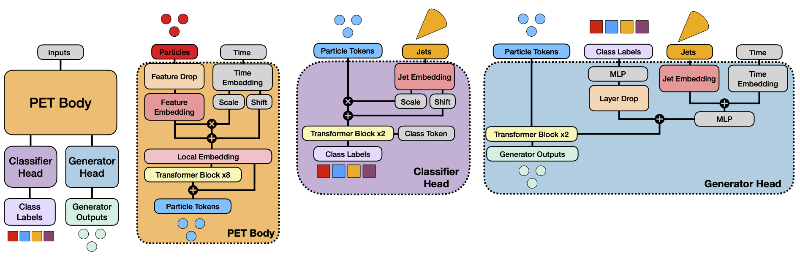

# Official Repository for the OmniLearn paper


This is the repository used for Quantum Entanglement measurement for $pp \rightarrow \tau \tau$ system. For citing the OmniLearn, please: 

```
@article{Mikuni:2024qsr,
    author = "Mikuni, Vinicius and Nachman, Benjamin",
    title = "{OmniLearn: A Method to Simultaneously Facilitate All Jet Physics Tasks}",
    eprint = "2404.16091",
    archivePrefix = "arXiv",
    primaryClass = "hep-ph",
    month = "4",
    year = "2024"
}
```


# Installation

The list of packages needed to train/evaluate the model is found in the ```requirements.txt``` file. Alternatively, you can use the Docker container found in this [link](https://hub.docker.com/layers/vmikuni/tensorflow/ngc-23.12-tf2-v1/images/sha256-7aa143ab71775056f1ed3f74f1b7624e55f38108739374af958015dafea45eb3?context=repo).

Our **recommendation** is to use the docker container.

# Data

## $pp \rightarrow \tau^+ \tau^- \rightarrow \pi^+ \bar{\nu_{\tau}} \pi \nu_{\tau}$ 

You can find the file in Cluster@INPAC:
```bash

```

# Training OmniLearn for neutrino reconstruction
For the training run:

```bash
cd scripts
python train.py --dataset "pipi" --layer_scale --local
```

## Evaluation

The evaluation of the trained $pp \rightarrow \tau^+ \tau^- \rightarrow \pi^+ \bar{\nu_{\tau}} \pi \nu_{\tau}$ samples:

```bash
python evaluate_recon.py ---layer_scale --local
```